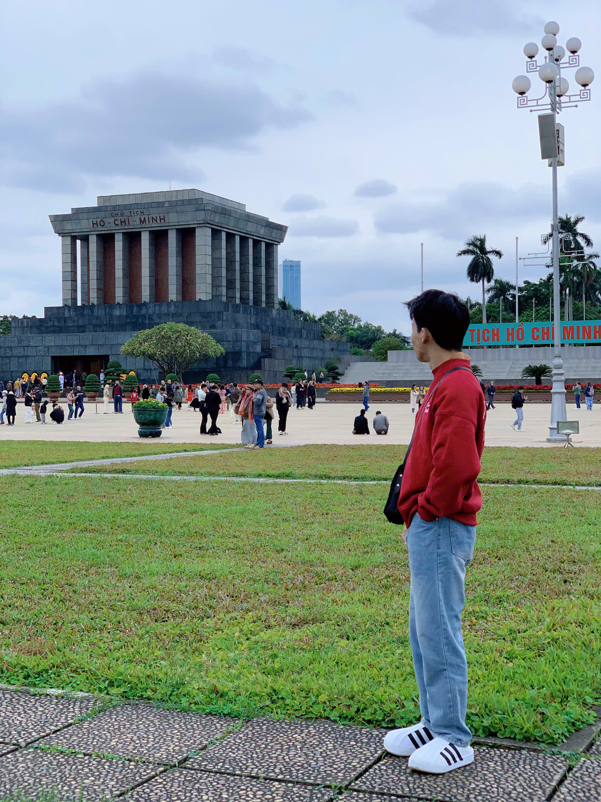

<!-- PROJECT LOGO -->
 

  <h1 align="center">Hà Ngọc Tiến</h1>
   
  

    Full-Stack Developer in Ho Chi Minh City
  

## 👱 About Me

Hi, I'm Hà Ngọc Tiến, a Junior Full-Stack Developer freshly graduated with 7 months of practical experience in real-world projects.
I have a solid foundation in HTML/CSS, JavaScript, ReactJS, ExpressJS, and Laravel, and am passionate about continuously learning new technologies.
I work well in team environments, communicate clearly, and always aim to deliver user-friendly, high-quality websites

---

## 🛠 Skills

🥪 **Front End** / 🥗 **Backend**

## 🔥 Achievements

- 🏆 **Top 7** in the **Ho Chi Minh City Excellent Student Web Design Competition** 2024

---

## 🔨 Tools I Use

## 🎯 Contribution

- [Backend Project](https://cards.fimi.tech/)
- [Fullstack Project](https://app.zudo.vn/)

---

## 📈 My GitHub Stats

<a href="https://github.com/TienLoFi">
    <picture>
        <source media="(prefers-color-scheme: dark)" srcset="https://github-readme-activity-graph.vercel.app/graph?username=vuvandinh123&theme=github-dark&area=true&hide_border=true&custom_title=Past%20Months%20Activity&color=ffffff&bg_color=0e1116">
        
    </picture>
</a>

(<a href="#top">Back to top</a>)

---

## 📅 Current Work

I'm currently focused on improving my skills in **ReactJS** and **Laravel**, while also exploring new technologies like **Docker** and **AWS** to optimize and deploy apps.

---

(<a href="#top">Back to top</a>)

